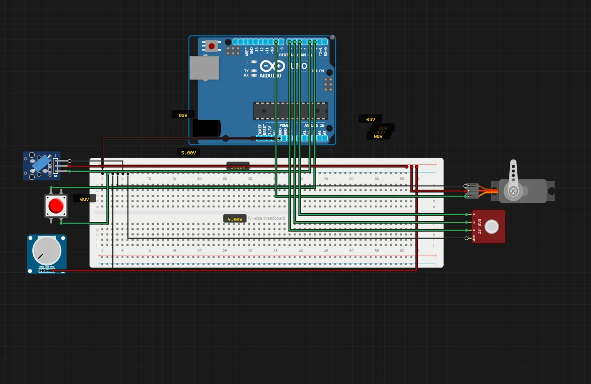

# Smart Trashcan Opening System

> Built in [Breadboard](https://breadboard.hackclub.com), a Hack Club program. This project took ~1.3 hours of work.

## What It Does

opens the trash can lid using a servo that is controlled using a tap switch, potentiometer and an vibration switch

## How It Works

The circuit is captured in `breadboard-project.json`, and the firmware that runs it is in the `firmware/` folder.

## How To Use It

This is my automatic trash can opening system. It uses the servo to lift the lid and the RGB LED to indicate the state. Potentiometer, tact switch and vibration switch are used to give inputs to the system.

## Demo

- **Simulate it live:** [https://breadboard.hackclub.com/share/184](https://breadboard.hackclub.com/share/184), runs the firmware in the Breadboard simulator
- **View the design:** [https://taniwankenobi.github.io/breadboard-plays/p/184/](https://taniwankenobi.github.io/breadboard-plays/p/184/)

## Schematic

The editor snapshot is in `breadboard-project.json`.

## Bill of Materials

| Part | Quantity |
| --- | --- |
| Arduino | 1 |
| Bredboard | 1 |
| RGB LED | 1 |
| Servo | 1 |
| Potentiometer | 1 |
| Vibration Switch | 1 |
| Tact Switch | 1 |

## Firmware

Firmware files are in the `firmware/` folder.

## Build Journal

Build journal entries are kept in [`journals.md`](journals.md).

---

*Made in [Breadboard](https://breadboard.hackclub.com) — 1.3h of work*

